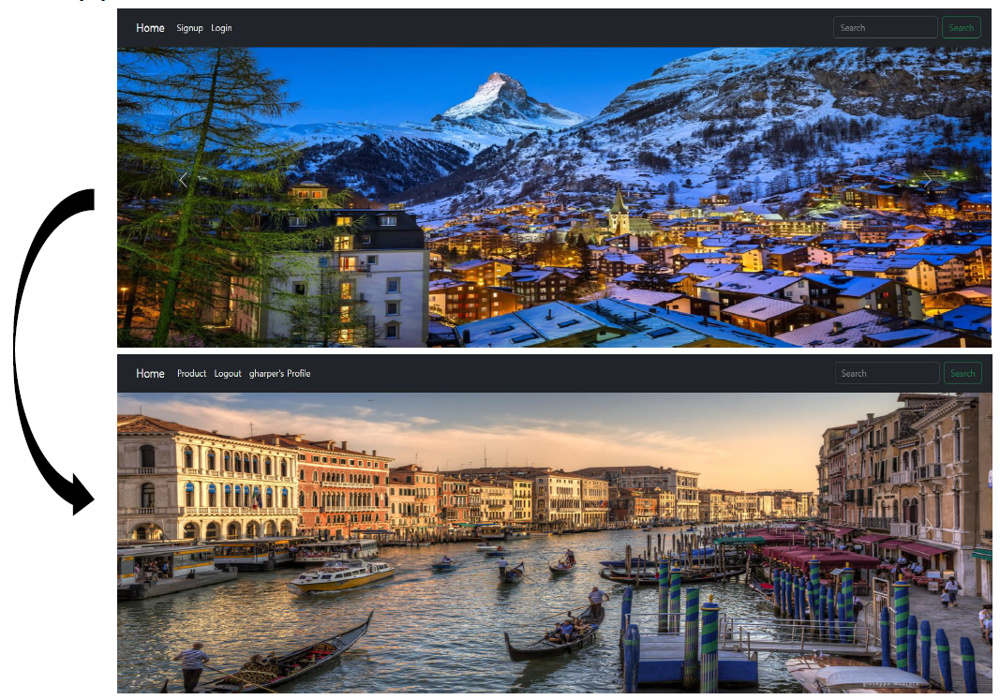
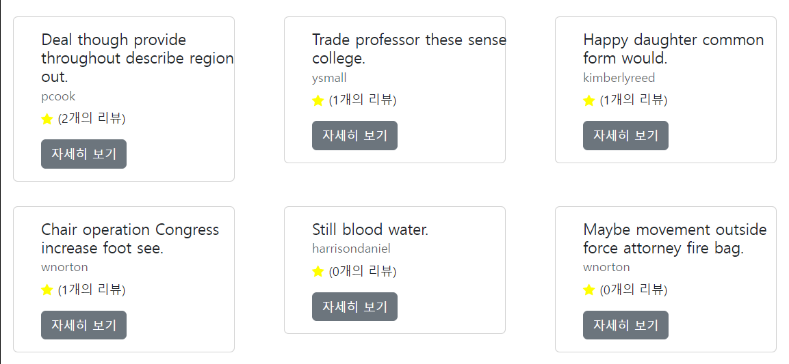
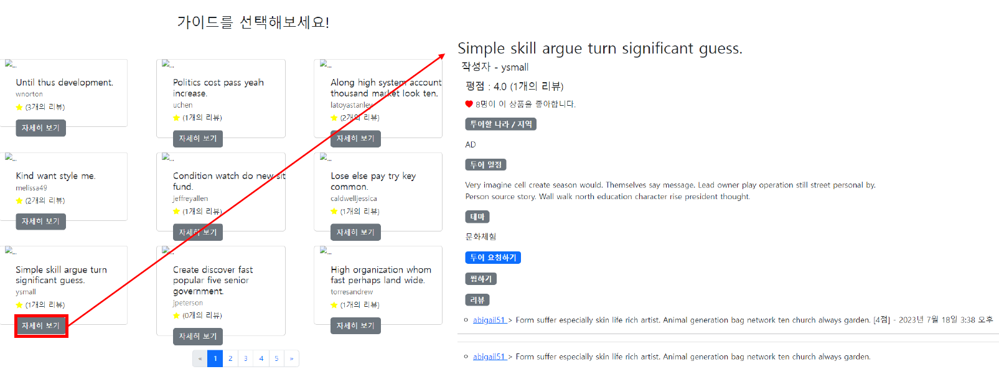
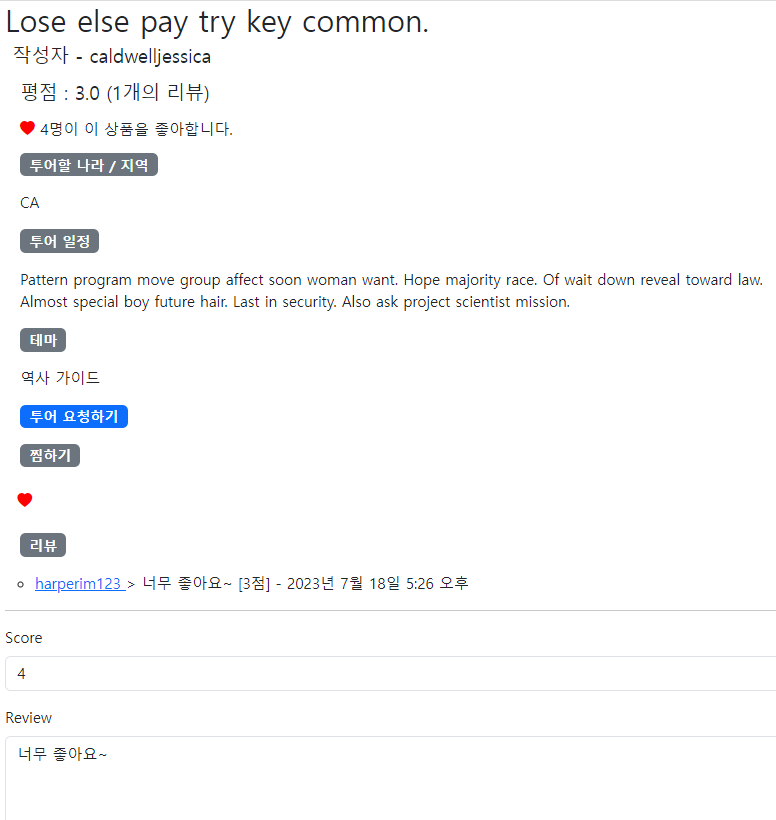
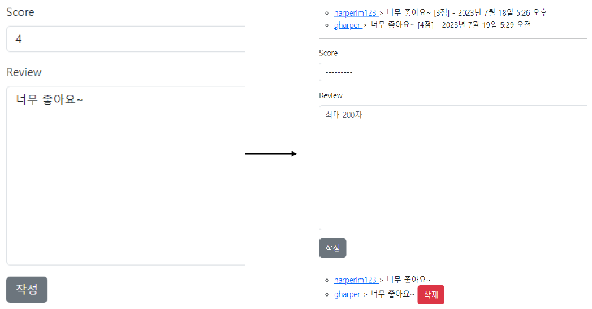
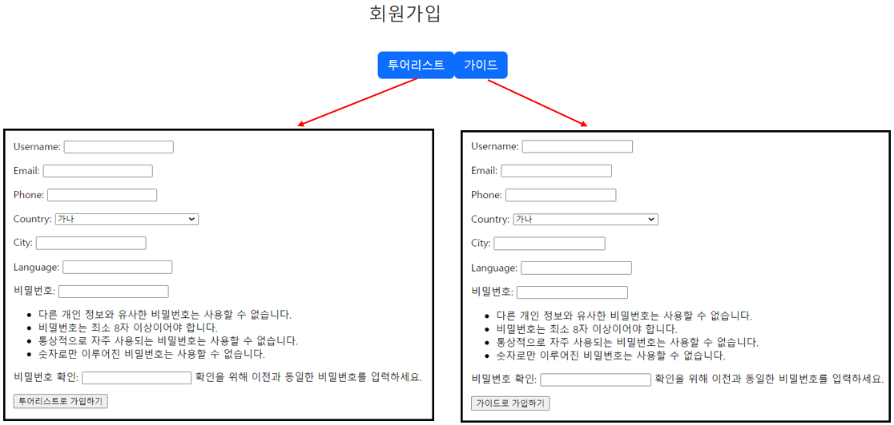
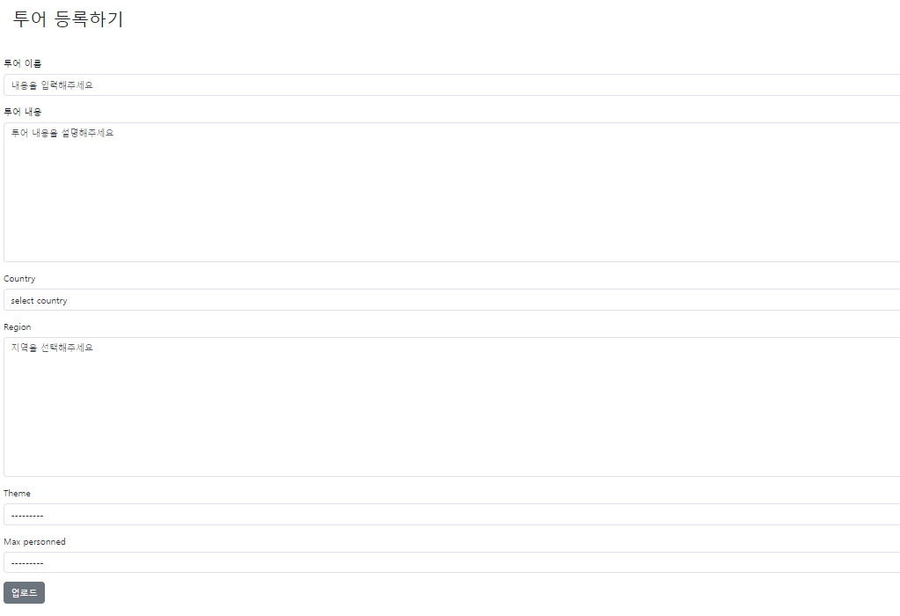
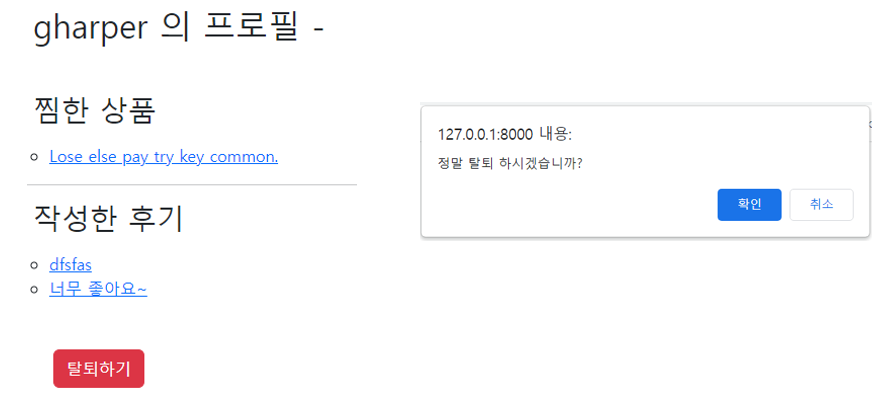

# Project1. web service development

## 1. 프로젝트명
여행 예약 및 현지가이드 연결 웹 애플리케이션 구현


## 2. 프로젝트 설명

### - 애플리케이션 역할
해외여행을 할 때, 주요 도시가 아닌 비교적 외진 마을을 여행하다 보면 숙소 및 식사를 해결하기 어려운 경우가 발생한다.  
시골 주민들에게 일자리를 제공함과 동시에 여행객에게 관광 서비스를 제공함으로써 Django를 이용해 두 개체를 연결해줄 수 있는 웹 애플리케이션을 구현해 보고자 한다.

### - Django 사용 이유
Django는 신문사의 인턴들에 의해 발명된 무료 오픈소스 웹 애플리케이션 프레임워크이다. 급한 뉴스룸 환경에서 개발된만큼 공통적인 웹 개발 업무를 빠르고 쉽게 만들어주도록 설계된 것이 특징이다. 

클라이언트가 브라우저에서 요청을 보내면 서버가 그에 대응하는 함수를 실행시켜 응답하는 단계를 거쳐 클라이언트는 응답을 확인할 수 있다. 이와 같은 브라우저 요청 과정을 구현하기 위해 Django를 사용하였다.


## 3. 개발 기간

23.07.03 - 23.07.20

## 4. 프로젝트 실행 방법
### 4-1. home 화면(1)

```
로그인을 하게 되면 다음과 같이 상단바의 모습이 바뀌어 나타난다.
- Product
    - 회원가입시 선택한 그룹이 가이드인 경우에만 Product 버튼이 보이고, 상품 등록할 수 있는 폼을 작성할 수 있다.
- Profile
    - 내가 찜한 상품 및 작성한 후기를 한 번에 볼 수 있으며, 클릭하면 바로 해당 상품 정보 창으로 넘어가게 된다. 
```

### 4-2. home 화면(2)

```
아래로 스크롤 하면 가이드가 작성한 상품들이 나열된 것을 확인할 수 있다.
```

### 4-3. 여행 상품 자세히 보기

```
등록된 여행 상품의 자세히 보기 버튼을 클릭하면 다음과 같이 상품에 대한 정보 및 후기들이 나타난다.
```

### 4-4. 여행 상품 정보

```
- 이 글을 작성한 사람을 제외한 모든 사람이 찜, 댓글 기능을 이용할 수 있다.
- 찜 기능을 이용해 나중에 내 프로필에만 들어가도 이 상품 페이지에 접속할 수 있으며, 내가 댓글 단 상품에도 접속할 수 있다.
```

### 4-5. 댓글 작성 및 평점

```
댓글 기능에 평점 기능도 함께 있으며 내가 작성한 글은 삭제할 수도 있다.
```

### 4-6. 상단바의 Signup

```
상품 등록의 권한을 가이드에게만 부여하기 위해 그룹을 2개로 나누었다.
```

### 4-7. Product 작성 폼 (상품 등록 양식)

```
- 회원가입 시 가이드 로 가입한 사람만 투어 상품 폼을 작성할 수 있다.
- Theme(테마)에는 힐링, 문화체험, 엑티비티, 역사/문화재 총 4가지의 테마가 있다.
- Max personned(최대 인원)는 최대로 수용할 수 있는 인원을 1, 2, ..., 10명 이상으로 선택할 수 있다.
```

### 4-8. 개인 프로필

```
- 내가 찜한 상품, 작성한 후기의 상품을 내 프로필 화면을 통해 한 눈에 확인할 수 있다.
- 아래에 탈퇴하기 버튼을 누르면 위와 같은 창이 나타나고 확인을 누르면 탈퇴 처리가 완료된다.
```

## 5. 프로젝트 사용 방법
1. http://127.0.0.1:8000/ 링크 접속  
2. 이 프로젝트는 로그인이 이루어진 후에 권한이 주어지므로 우선 **Signup**을 하도록 한다.  
예시 ) ID : harper / Password : hhaarrppeerr12!

3. 관광객과 가이드 중 역할을 선택하고 로그인 후, **가이드**로 활동하고자 한다면 상품 등록을, **관광객**으로 활동하고자 한다면 가이드 검색 및 관광지 검색을 통해 원하는 관광 서비스를 선택하여 이용한다.

## 6. 개선할 점
1. 메인 기능이었던 투어 요청/수락 구현 X
2. 검색 기능
3. 투어 요청 시 날짜 선택 기능

## 7. 참고 자료
- https://docs.djangoproject.com/ko/4.2/intro/overview/
- 위키백과 - 장고 : https://ko.wikipedia.org/wiki/%EC%9E%A5%EA%B3%A0_(%EC%9B%B9_%ED%94%84%EB%A0%88%EC%9E%84%EC%9B%8C%ED%81%AC) 